<div align="center">

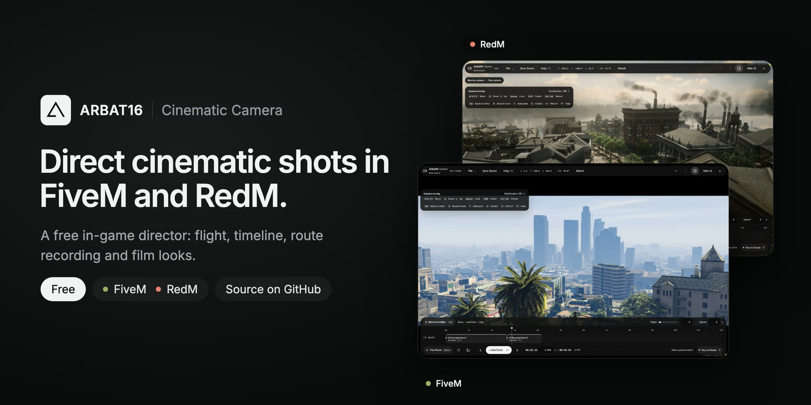

# ARBAT16 Cinematic Camera

**Direct cinematic shots inside FiveM and RedM.**<br>Fly the camera, save your angles, lay the shot out on a timeline and play it back while your recorder runs.

[](https://github.com/AppiChudilko/ARBAT16-CINEMATIC_CAMERA/releases/tag/v1.8.0)   

[**Download the ZIP**](https://github.com/AppiChudilko/ARBAT16-CINEMATIC_CAMERA/releases/download/v1.8.0/arbat16_camera-v1.8.0.zip) · [Website](https://store.arbat16.com/cinematic-camera) · [User guide](resource/arbat16_camera/README.md) · [Changelog](resource/arbat16_camera/CHANGELOG.md) · [Report a problem](https://github.com/AppiChudilko/ARBAT16-CINEMATIC_CAMERA/issues) · [Discord](https://dscrd.in/arbat16)

</div>

<br>

A standalone Lua director for FiveM and RedM: free flight, saved camera angles, a keyframe timeline and route recording, with film looks and composition guides on top. The English interface stays see-through over the game, so you always frame the real picture.

**Version 1.8.0 uses one resource for both games.** It detects GTA V or RDR3 automatically and selects the matching camera natives, weather, filters and attachment controls. No game setting or separate download is required.

| Command | Resource | Permission | Framework | Storage |
| :-- | :-- | :-- | :-- | :-- |
| `/ar16_cam` | `arbat16_camera` | ACE `arbat16_camera.use` | None | Server resource KVP |

## Shot with the camera

<a href="https://store.arbat16.com/cinematic-camera#reel">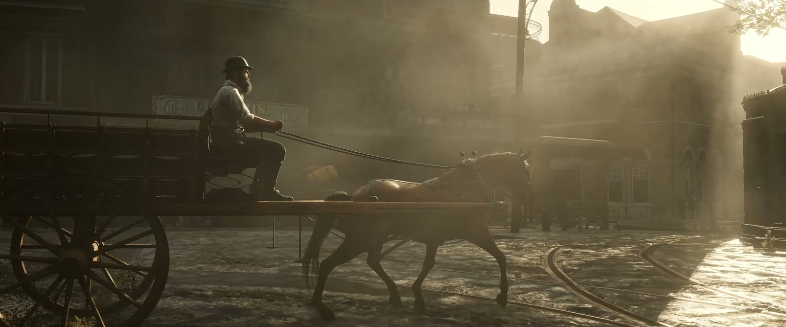</a>

<sub><b>RedM</b>: a Saint Denis street flown and framed at 2.39:1 with the camera. Watch the clip on the <a href="https://store.arbat16.com/cinematic-camera#reel">website</a>.</sub>

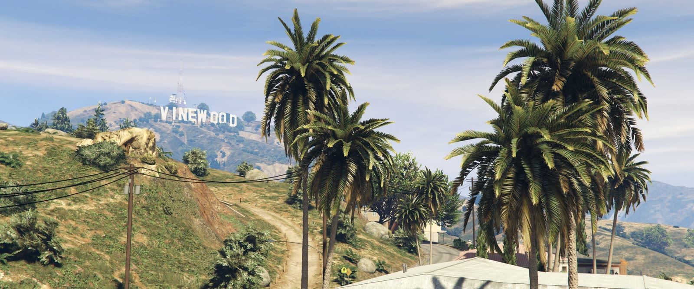

<sub><b>FiveM</b>: the Vinewood Hills in Los Santos, framed at 2.39:1 with the interface hidden.</sub>

<table>
  <tr>
    <td width="50%" valign="top">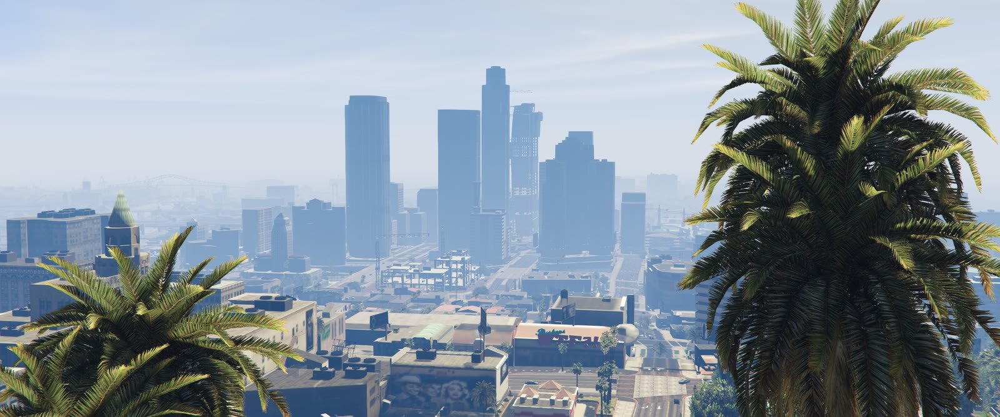<br><sub><b>FiveM</b>, downtown Los Santos</sub></td>
    <td width="50%" valign="top">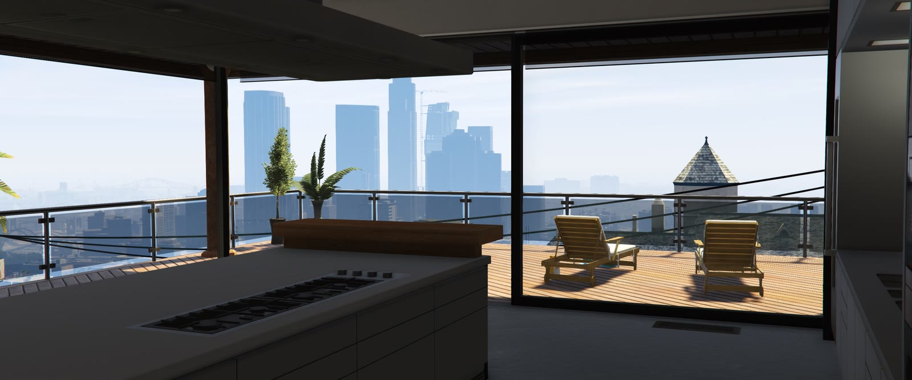<br><sub><b>FiveM</b>, a penthouse over the city</sub></td>
  </tr>
</table>

Every screenshot on this page is labeled with its game. Both games share the editor layout; each uses its own game effects and environments.

## Features

<table>
  <tr>
    <td width="50%" valign="top">
      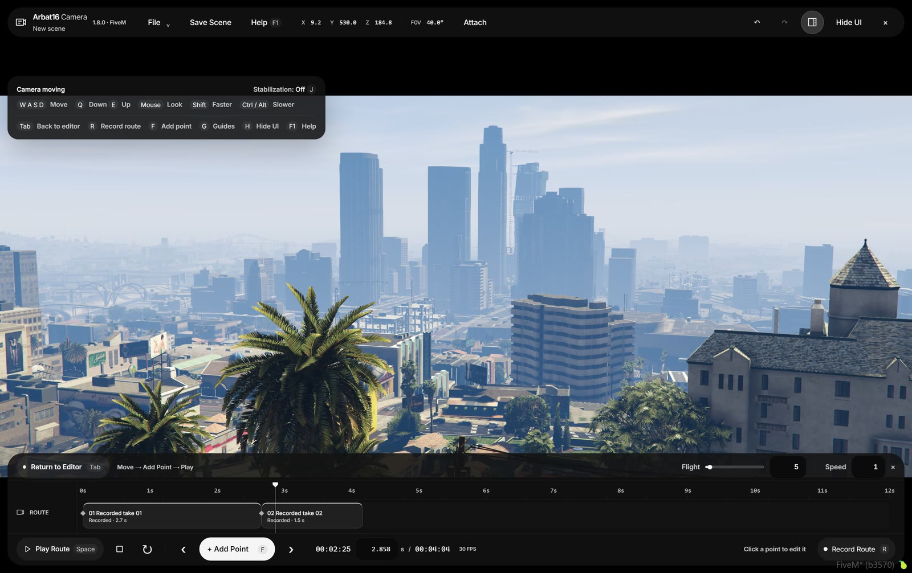<br><sub><b>FiveM</b></sub>
      <h3>Fly it like a camera operator</h3>
      <kbd>W</kbd> <kbd>A</kbd> <kbd>S</kbd> <kbd>D</kbd> to move, <kbd>Q</kbd> <kbd>E</kbd> for height, the mouse to look. Hold <kbd>Shift</kbd> to cover ground, <kbd>Alt</kbd> or <kbd>Ctrl</kbd> to creep into position, and pick Off, Light, Medium or Strong stabilization for a steady move.
    </td>
    <td width="50%" valign="top">
      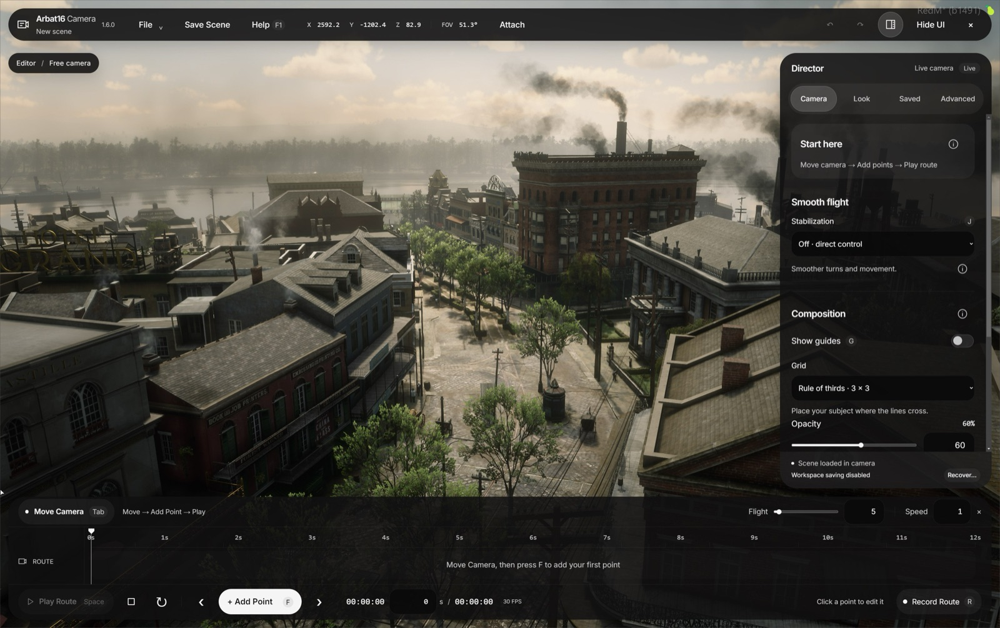<br><sub><b>RedM</b></sub>
      <h3>Build the shot on a timeline</h3>
      Drop points with <kbd>F</kbd>, set how long each move takes and how it eases. Linear, Catmull-Rom and Bezier paths, six easing modes, cuts, holds, multi-select and 50 steps of undo.
    </td>
  </tr>
  <tr>
    <td width="50%" valign="top">
      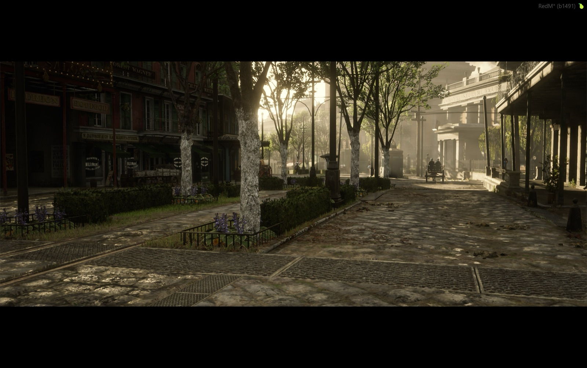<br><sub><b>RedM</b></sub>
      <h3>Record a move and play it back</h3>
      Press <kbd>R</kbd>, fly the shot by hand and press <kbd>R</kbd> again. Up to 30 samples a second with real timing, so a pause in your hand stays a pause on screen. Takes run up to five minutes.
    </td>
    <td width="50%" valign="top">
      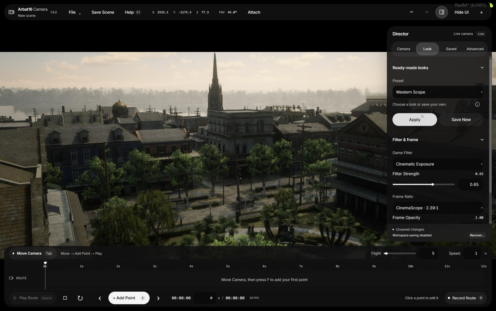<br><sub><b>RedM</b></sub>
      <h3>Six looks, seven frames</h3>
      Six ready-made presets, game-specific native filters including Black &amp; White, and frames from native to 2.39:1 CinemaScope. Tune the filter strength and save up to 40 presets of your own.
    </td>
  </tr>
  <tr>
    <td width="50%" valign="top">
      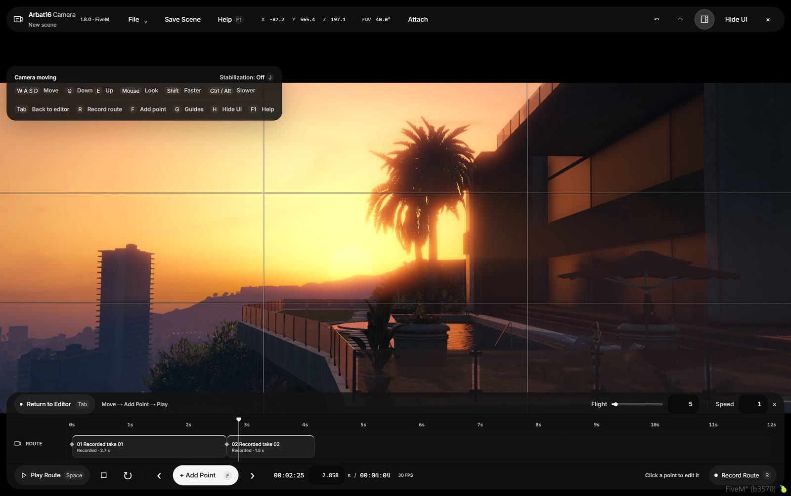<br><sub><b>FiveM</b></sub>
      <h3>Frame it like a cinematographer</h3>
      Press <kbd>G</kbd> for rule of thirds, golden ratio, diagonals, a fine grid, a centre cross or safe areas. Guides follow the chosen frame and hide together with the interface.
    </td>
    <td width="50%" valign="top">
      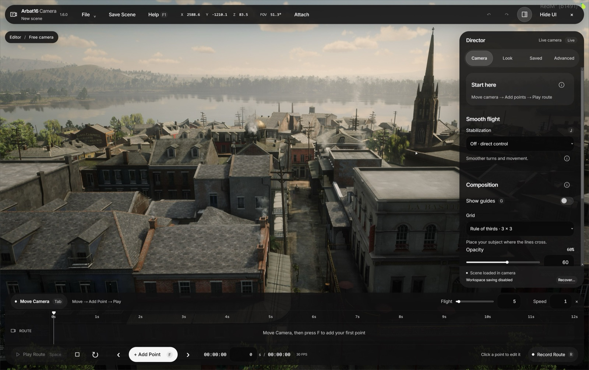<br><sub><b>RedM</b></sub>
      <h3>Keep every angle you liked</h3>
      Save up to 100 named cameras with markers in the world, drag them onto the timeline as holds and keep whole scenes in a library tied to your license. The workspace autosaves.
    </td>
  </tr>
</table>

<details>
<summary><b>RedM looks side by side</b></summary>
<br>

<table>
  <tr>
    <td width="50%" valign="top"><br><sub><b>Western Scope</b>, CinemaScope 2.39:1</sub></td>
    <td width="50%" valign="top">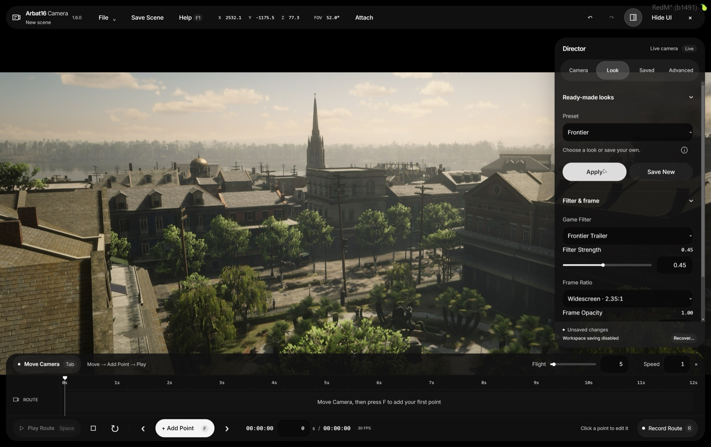<br><sub><b>Frontier</b>, widescreen 2.35:1</sub></td>
  </tr>
  <tr>
    <td width="50%" valign="top">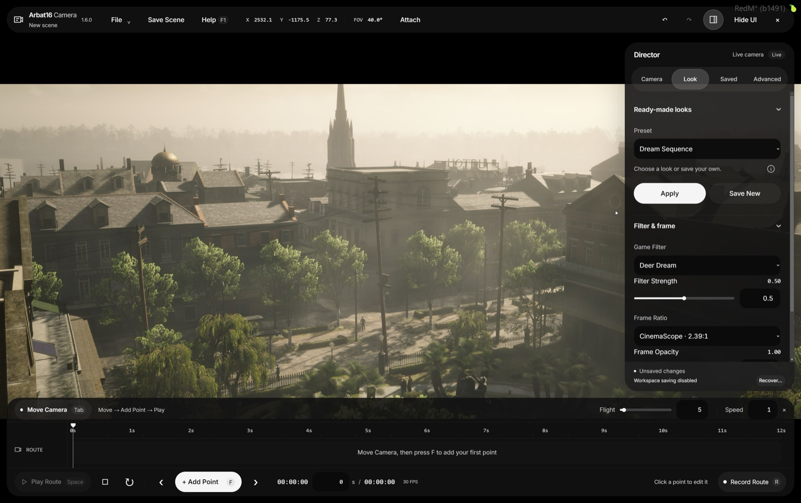<br><sub><b>Dream Sequence</b>, CinemaScope 2.39:1</sub></td>
    <td width="50%" valign="top">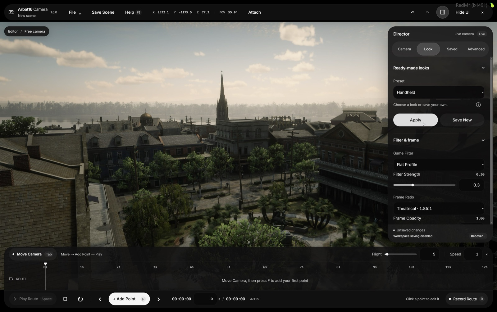<br><sub><b>Handheld</b>, theatrical 1.85:1</sub></td>
  </tr>
  <tr>
    <td width="50%" valign="top">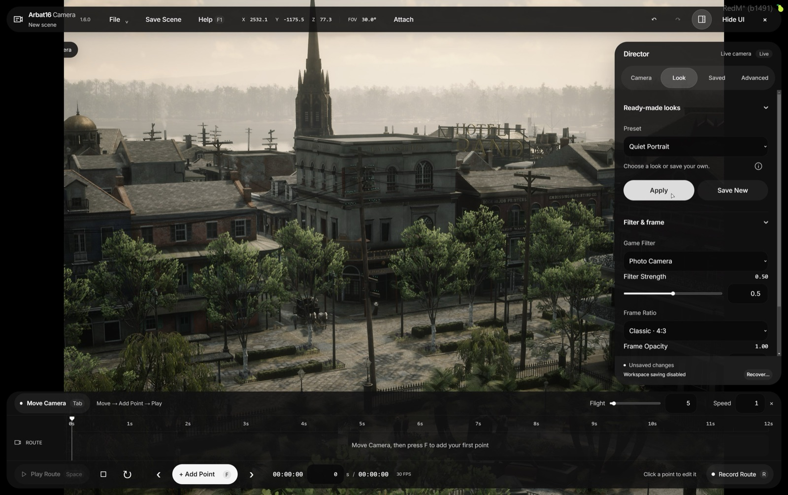<br><sub><b>Quiet Portrait</b>, classic 4:3</sub></td>
    <td width="50%" valign="top">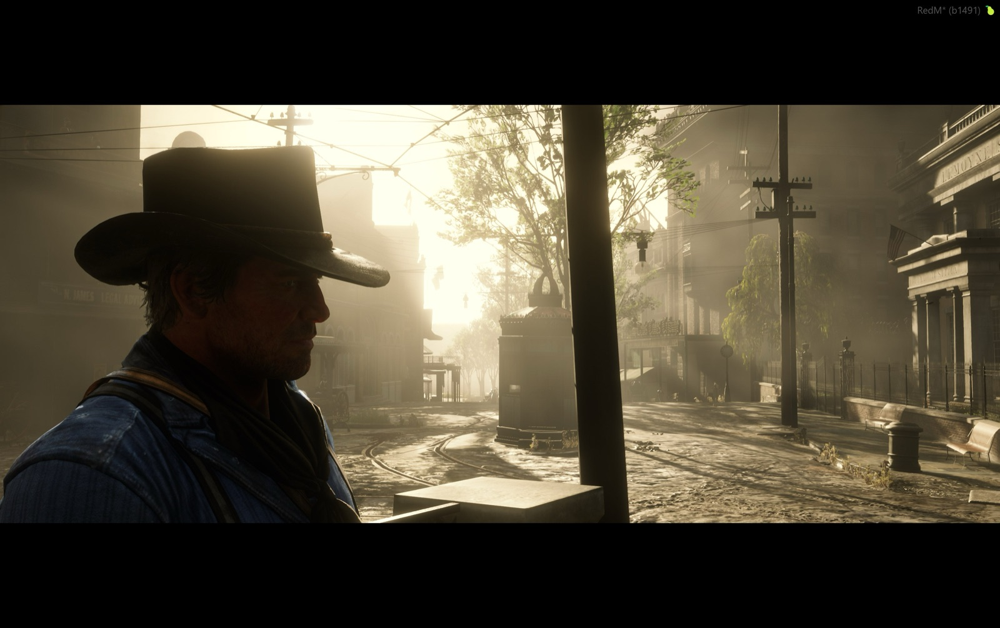<br><sub><b>Clean view</b>, interface hidden with <kbd>H</kbd></sub></td>
  </tr>
</table>

The sixth look, **Natural**, keeps the game picture as it is.

</details>

### And the rest

- **Camera moves in one click:** dolly, truck, crane, pan and orbit land on the timeline ready to edit, with an optional return to the start.
- **Handheld and sway:** motion with amplitude, frequency and roll on top of a clean saved path.
- **Time and weather per keyframe:** local environment for every point; time blends across midnight the short way.
- **Follow a subject:** attach the route to the player, their current vehicle in FiveM, their horse or vehicle in RedM, or an entity under the crosshair.
- **Focus controls:** FiveM adds a depth-of-field switch and adjustable blur strength; RedM keeps its focus-distance control. The editor shows the controls supported by the current game.
- **Scene library:** named scenes on the server with JSON import and export.
- **Numbers everywhere:** every slider has an exact numeric field, plus click-to-read help and a full in-game guide on <kbd>F1</kbd>.
- **Built for big screens:** a monochrome, see-through interface that scales up to 4K and ultrawide and never tints the game.

> [!NOTE]
> **Record Route records camera movement, not a video file.** Play the route back and capture the picture and sound with OBS or any other recorder. Filters currently apply to the whole scene, not to individual timeline clips.

## Install

1. Download [arbat16_camera-v1.8.0.zip](https://github.com/AppiChudilko/ARBAT16-CINEMATIC_CAMERA/releases/download/v1.8.0/arbat16_camera-v1.8.0.zip) from [release v1.8.0](https://github.com/AppiChudilko/ARBAT16-CINEMATIC_CAMERA/releases/tag/v1.8.0). Its [SHA-256 checksum](https://github.com/AppiChudilko/ARBAT16-CINEMATIC_CAMERA/releases/download/v1.8.0/arbat16_camera-v1.8.0.zip.sha256) is available alongside it.
2. Extract the archive's **`arbat16_camera`** folder into your FiveM or RedM server's `resources` directory. The manifest should end up at `resources/arbat16_camera/fxmanifest.lua`; keep the folder name.
3. Add these lines to `server.cfg`:

   ```cfg
   add_ace group.admin arbat16_camera.use allow
   ensure arbat16_camera
   ```

4. Restart the server, or run `refresh` and `ensure arbat16_camera` in the console, then type `/ar16_cam` in chat.

The same folder runs in both games and detects the platform automatically. No framework, database, npm build or external font download is needed. The release ZIP contains the ready-to-install resource and its license documents.

> [!TIP]
> To give the camera to one player instead of the whole admin group, grant the ACE to their license:
>
> ```cfg
> add_ace identifier.license:YOUR_LICENSE arbat16_camera.use allow
> ```
>
> ACE changes in `server.cfg` are read on server start. Run the `add_ace` line in the console to apply it right away.

> [!IMPORTANT]
> **Updating?** Back up your configuration and the server KVP data first: the ZIP contains code, not saved scenes. Stop the resource, replace its files and start it again. Do not run the old and new copies at the same time.

## Controls

| Keys | Action |
| :-- | :-- |
| <kbd>Tab</kbd> | Switch between flying and editing |
| <kbd>W</kbd> <kbd>A</kbd> <kbd>S</kbd> <kbd>D</kbd> | Move forward, left, back and right |
| <kbd>Q</kbd> / <kbd>E</kbd> | Down / up |
| <kbd>Shift</kbd> | Fly faster, 4x by default |
| <kbd>Alt</kbd> / <kbd>Ctrl</kbd> | Fly slower |
| <kbd>J</kbd> | Cycle stabilization: Off, Light, Medium, Strong |
| <kbd>F</kbd> | Add a route point |
| <kbd>R</kbd> | Start or stop route recording |
| <kbd>Space</kbd> | Play or pause the route |
| <kbd>G</kbd> | Show or hide composition guides |
| <kbd>H</kbd> | Hide the interface for a clean frame |
| <kbd>F1</kbd> | Open the in-game guide |
| <kbd>Ctrl</kbd> + <kbd>S</kbd> | Save the scene |
| <kbd>Ctrl</kbd> + <kbd>Z</kbd> / <kbd>Ctrl</kbd> + <kbd>Shift</kbd> + <kbd>Z</kbd> | Undo / redo |
| <kbd>Ctrl</kbd> + <kbd>C</kbd> / <kbd>V</kbd> / <kbd>A</kbd> | Copy, paste, select all keyframes |
| <kbd>←</kbd> / <kbd>→</kbd> | Step 1/30 of a second |
| <kbd>Delete</kbd> | Delete selected keyframes |
| <kbd>Esc</kbd> | Close a dialog, leave mouse capture or exit the editor |

Shortcuts pause while you type in a field. The full reference lives in the [user guide](resource/arbat16_camera/README.md#controls).

<details>
<summary><b>Configuration</b>: <code>config.lua</code> options</summary>
<br>

| Setting | Default | Purpose |
| :-- | :-- | :-- |
| `Command` | `ar16_cam` | Open and close command |
| `RequireAce` / `AcePermission` | `true` / `arbat16_camera.use` | Server permission |
| `Diagnostics` | `false` | Automatic bounded camera and input reports |
| `DefaultSpeed` | `5.0` | Flight speed |
| `FastMultiplier` / `SlowMultiplier` | `4.0` / `0.2` | Flight modifiers |
| `LookSensitivity` | `0.12` | Mouse sensitivity |
| `RecordInterval` | `33` | Record target interval in milliseconds, 30 Hz at most |
| `MaxFrames` / `MaxScenes` | `200` / `30` | Scene and library limits |
| `MaxSceneBytes` | `4194304` | Serialized scene limit, 4 MiB |
| `StorageCooldown` | `600` | Library request interval, milliseconds |
| `FreezePlayer` | `true` | Keep the player's body still while filming |
| `WeatherEnabled` | `true` | Apply local time and weather |
| `MaxDistance` | `2000.0` | Distance limit from the player, meters |

Scenes and workspaces are stored in server resource KVP under each player's license. Export JSON or back up the KVP database to keep them. Existing RedM workspaces remain compatible. Scene exports are intended for the same game: the resource does not convert map coordinates or weather between GTA V and RDR3.

</details>

<details>
<summary><b>Commands and troubleshooting</b></summary>
<br>

| Command | Where | What it does |
| :-- | :-- | :-- |
| `/ar16_cam` | Chat, or `ar16_cam` in F8 | Open or close the camera |
| `/ar16_camresetview` | Chat | Move the active view back to your player; keeps saved cameras and scenes |
| `ar16_camdebug` | F8, camera open | Print camera, input and timeline state; read-only |
| `ar16_camclose` | F8 | Emergency cleanup of the camera, focus and player freeze |

If flight or playback does not move the camera, run `ar16_camdebug` while the camera is open and paste its output into an [issue](https://github.com/AppiChudilko/ARBAT16-CINEMATIC_CAMERA/issues). With `Diagnostics=true` the server also writes `camera-diagnostics.jsonl` inside the resource, capped at 256 KiB, with no license, account name or hardware identifiers.

Use one camera editor at a time. RedM retains `simple_weather` integration. FiveM uses local weather and clock overrides; a continuously syncing weather controller may overwrite them and needs to be coordinated for filming.

</details>

## License

**Free to use. Free to change. Not for resale.**

| You can | You cannot |
| :-- | :-- |
| Run it on public, private, commercial and paid-access servers | Sell, resell or rent the resource or a changed copy |
| Sell the videos, streams and images you make with it | Charge for access to it or put it in a paid bundle |
| Use it for client filming work | Remove the license and notices from copies you share |
| Change it for any lawful purpose and share copies for free | |

This is the custom **ARBAT16 Source-Available License 1.0 (No Resale)**, not MIT and not an OSI open-source license. Official distribution by ARBAT16 is separate from these recipient restrictions.

[Full terms](LICENSE.txt) · [License FAQ](resource/arbat16_camera/docs/LICENSE-FAQ.md) · [Third-party notices](resource/arbat16_camera/THIRD_PARTY_NOTICES.md)

## Development

The installable resource lives in `resource/arbat16_camera`. Node.js 24, Python 3.13 and pnpm are needed only to change or test the source:

```text
pnpm install --frozen-lockfile
python -m pip install -r requirements-dev.txt
python tests/arbat16_camera_suite.py
python tools/build_release.py
```

The build produces one installable resource folder with its license documents and a SHA-256 checksum. Logs, tests, build tools, dependency folders and this `docs/` folder are left out of the ZIP.

Native checks use four reference fixtures fetched by `tools/fetch_native_references.py` at pinned commits and verified by hash. The first run needs network access; subsequent runs can use the cached fixtures offline.

Tests cover the logic and interface for both games. Version 1.8.0 still needs an in-game smoke test in **FiveM and RedM**: native effects and compatibility with other camera or weather resources depend on that environment. The screenshots above do not replace that test.

[Changes](resource/arbat16_camera/CHANGELOG.md) · [Tebex product text](resource/arbat16_camera/docs/TEBEX-DESCRIPTION.md) · [Publishing notes](resource/arbat16_camera/docs/PUBLISHING.md)

<br>

<div align="center">
<sub>Made by <a href="https://arbat16.com">ARBAT16</a> · <a href="https://store.arbat16.com/cinematic-camera">Website</a> · <a href="https://dscrd.in/arbat16">Discord</a></sub>
</div>
